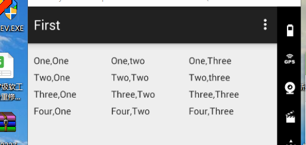
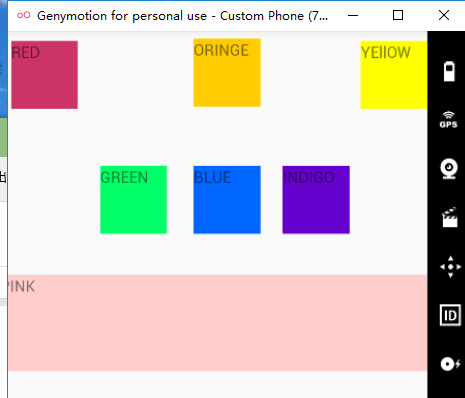
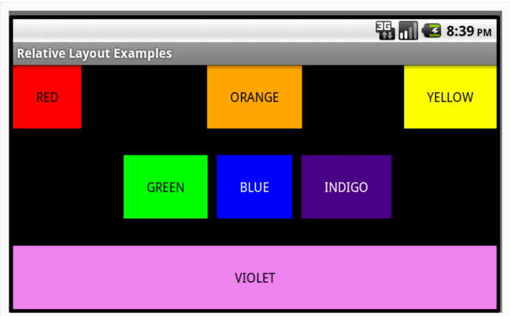

###                                           **Android开发实验二**

利用线性布局实现如下界面：

开发的代码：

```a
<LinearLayout xmlns:android="http://schemas.android.com/apk/res/android"    xmlns:tools="http://schemas.android.com/tools"    android:layout_width="match_parent"    android:layout_height="match_parent"    android:orientation="vertical"    android:paddingBottom="@dimen/activity_vertical_margin"    android:paddingLeft="@dimen/activity_horizontal_margin"    android:paddingRight="@dimen/activity_horizontal_margin"    android:paddingTop="@dimen/activity_vertical_margin"    tools:context=".MainActivity">    <LinearLayout        android:layout_width="fill_parent"        android:layout_height="100dp"        android:orientation="vertical">        <LinearLayout            android:layout_width="fill_parent"            android:layout_height="0dp"            android:layout_weight="1"            android:orientation="horizontal">            <LinearLayout                android:layout_width="0dp"                android:layout_height="fill_parent"                android:layout_weight="1">                <TextView                    android:layout_width="fill_parent"                    android:layout_height="fill_parent"                    android:text="One,One" />            </LinearLayout>            <LinearLayout                android:layout_width="0dp"                android:layout_height="fill_parent"                android:layout_weight="1">                <TextView                    android:layout_width="fill_parent"                    android:layout_height="fill_parent"                    android:text="One,two" />            </LinearLayout>            <LinearLayout                android:layout_width="0dp"                android:layout_height="fill_parent"                android:layout_weight="1">                <TextView                    android:layout_width="fill_parent"                    android:layout_height="fill_parent"                    android:text="One,Three" />            </LinearLayout>        </LinearLayout>        <LinearLayout            android:layout_width="fill_parent"            android:layout_height="0dp"            android:layout_weight="1"            android:orientation="horizontal">            <LinearLayout                android:layout_width="0dp"                android:layout_height="fill_parent"                android:layout_weight="1">                <TextView                    android:layout_width="fill_parent"                    android:layout_height="fill_parent"                    android:text="Two,One" />            </LinearLayout>            <LinearLayout                android:layout_width="0dp"                android:layout_height="fill_parent"                android:layout_weight="1">                <TextView                    android:layout_width="fill_parent"                    android:layout_height="fill_parent"                    android:text="Two,Two" />            </LinearLayout>            <LinearLayout                android:layout_width="0dp"                android:layout_height="fill_parent"                android:layout_weight="1">                <TextView                    android:layout_width="fill_parent"                    android:layout_height="fill_parent"                    android:text="Two,three" />            </LinearLayout>        </LinearLayout>        <LinearLayout            android:layout_width="fill_parent"            android:layout_height="0dp"            android:layout_weight="1"            android:orientation="horizontal">            <LinearLayout                android:layout_width="0dp"                android:layout_height="fill_parent"                android:layout_weight="1">                <TextView                    android:layout_width="fill_parent"                    android:layout_height="fill_parent"                    android:text="Three,One" />            </LinearLayout>            <LinearLayout                android:layout_width="0dp"                android:layout_height="fill_parent"                android:layout_weight="1">                <TextView                    android:layout_width="fill_parent"                    android:layout_height="fill_parent"                    android:text="Three,Two" />            </LinearLayout>            <LinearLayout                android:layout_width="0dp"                android:layout_height="fill_parent"                android:layout_weight="1">                <TextView                    android:layout_width="fill_parent"                    android:layout_height="fill_parent"                    android:text="Three,Three" />            </LinearLayout>        </LinearLayout>        <LinearLayout            android:layout_width="fill_parent"            android:layout_height="0dp"            android:layout_weight="1"            android:orientation="horizontal">            <LinearLayout                android:layout_width="0dp"                android:layout_height="fill_parent"                android:layout_weight="1">                <TextView                    android:layout_width="fill_parent"                    android:layout_height="fill_parent"                    android:text="Four,One" />            </LinearLayout>            <LinearLayout                android:layout_width="0dp"                android:layout_height="fill_parent"                android:layout_weight="1">                <TextView                    android:layout_width="fill_parent"                    android:layout_height="fill_parent"                    android:text="Four,Two" />            </LinearLayout>            <LinearLayout                android:layout_width="0dp"                android:layout_height="fill_parent"                android:layout_weight="1">                <TextView                    android:layout_width="fill_parent"                    android:layout_height="fill_parent"                    android:text="Four,Three" />            </LinearLayout>        </LinearLayout>    </LinearLayout></LinearLayout>
```

**实验效果：**




**利用ConstraintLayout实现如下界面：**



​    **代码如下：**

<?xml version="1.0" encoding="utf-8"?><androidx.constraintlayout.widget.ConstraintLayout xmlns:android="http://schemas.android.com/apk/res/android"    xmlns:app="http://schemas.android.com/apk/res-auto"    xmlns:tools="http://schemas.android.com/tools"    android:layout_width="match_parent"    android:layout_height="match_parent"    tools:context=".MainActivity">    <TextView        android:id="@+id/iv_view2"        android:layout_width="401dp"        android:layout_height="85dp"        android:layout_marginTop="216dp"        android:background="#FFCCCC"        android:scaleType="fitXY"        android:text="PINK"        app:layout_constraintLeft_toLeftOf="parent"        app:layout_constraintTop_toTopOf="parent" />    <TextView        android:id="@+id/iv_view_4"        android:layout_width="60dp"        android:layout_height="60dp"        android:layout_marginLeft="20dp"        android:layout_marginTop="120dp"        android:background="#00FF66"        android:scaleType="fitXY"        android:text="GREEN"        app:layout_constraintLeft_toRightOf="@id/iv_view"        app:layout_constraintTop_toTopOf="parent" />    <TextView        android:id="@+id/iv_view_"        android:layout_width="60dp"        android:layout_height="60dp"        android:layout_marginLeft="104dp"        android:layout_marginTop="120dp"        android:background="#0066FF"        android:scaleType="fitXY"        android:text="BLUE"        app:layout_constraintLeft_toRightOf="@id/iv_view"        app:layout_constraintTop_toTopOf="parent" />    <TextView        android:id="@+id/iv_view_5"        android:layout_width="60dp"        android:layout_height="60dp"        android:layout_marginLeft="184dp"        android:layout_marginTop="120dp"        android:background="#6600CC"        android:scaleType="fitXY"        android:text="INDIGO"        app:layout_constraintLeft_toRightOf="@id/iv_view"        app:layout_constraintTop_toTopOf="parent" />    <TextView        android:id="@+id/iv_view"        android:layout_width="60dp"        android:layout_height="60dp"        android:scaleType="fitXY"        app:layout_constraintLeft_toLeftOf="parent"        app:layout_constraintTop_toTopOf="parent"        android:layout_marginLeft="10dp"        android:layout_marginTop="10dp"        android:background="#CC3366"        android:text="RED"        />    <TextView        android:id="@+id/iv_view_2"        android:layout_width="60dp"        android:layout_height="60dp"        android:layout_marginLeft="104dp"        android:layout_marginTop="8dp"        android:background="#FFCC00"        android:scaleType="fitXY"        android:text="ORINGE"        app:layout_constraintLeft_toRightOf="@id/iv_view"        app:layout_constraintTop_toTopOf="parent" />    <TextView        android:id="@+id/iv_view_3"        android:layout_width="60dp"        android:layout_height="60dp"        android:scaleType="fitXY"        app:layout_constraintLeft_toRightOf="@id/iv_view_2"        app:layout_constraintTop_toTopOf="parent"        android:layout_marginLeft="90dp"        android:layout_marginTop="10dp"        android:background="#FFFF00"        android:text="YEllOW"        /></androidx.constraintlayout.widget.ConstraintLayout>

**运行结果：**



