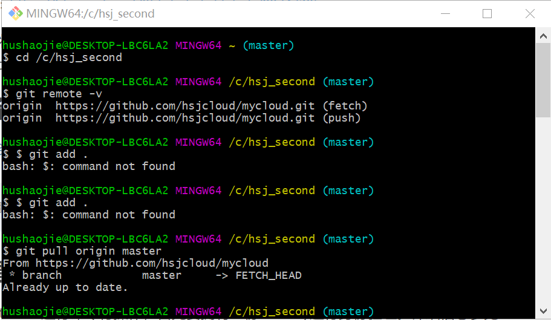
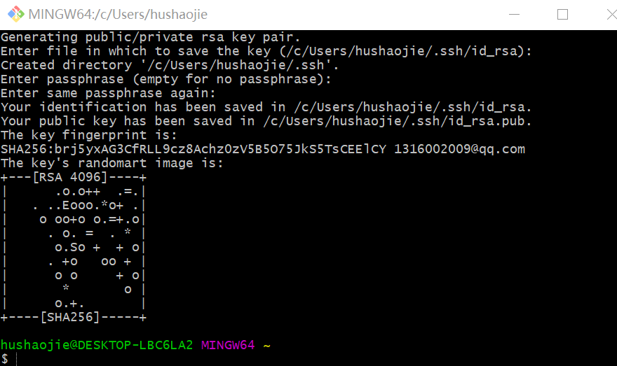
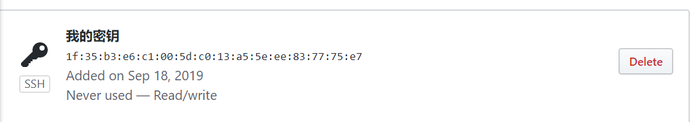
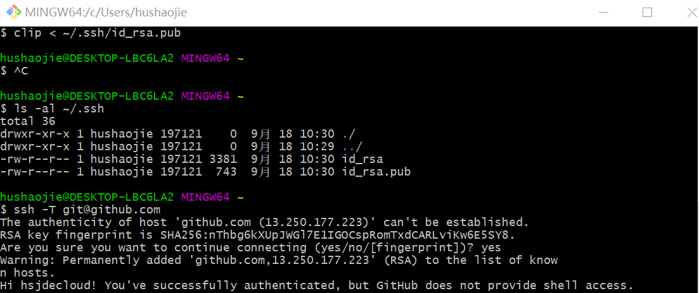
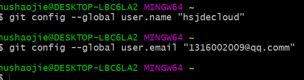
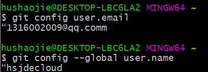
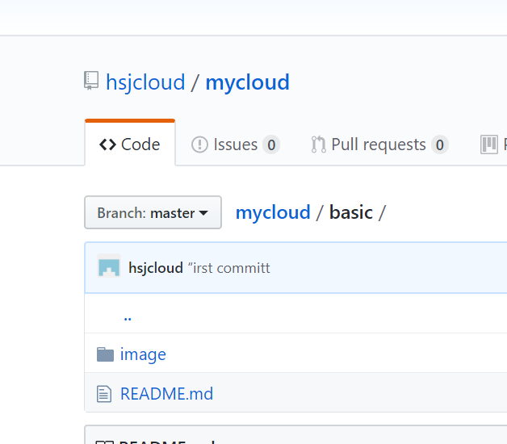
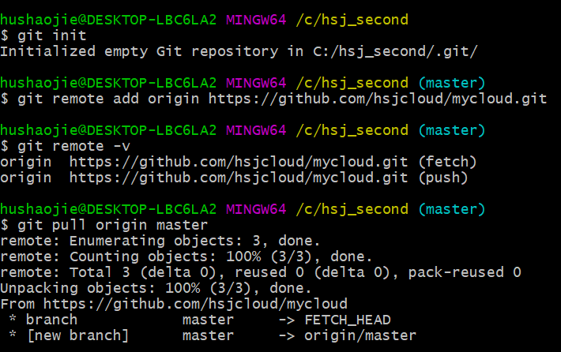
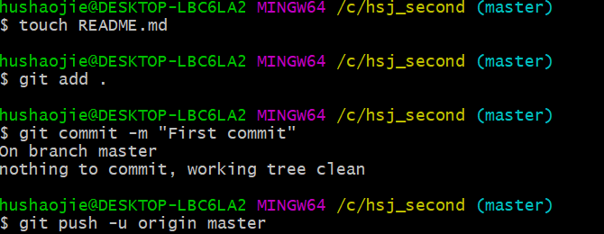
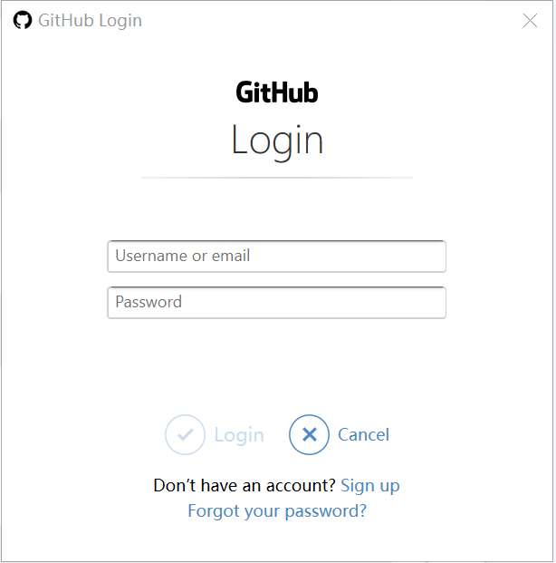

# 实验一 GitHub使用入门

本教程将介绍GitHub项目的创建以及Git Bash的使用（Windows环境）。在本文中链接了许多GitHub官方的帮助文档，文档描述了很多细节，仔细阅读很有帮助。

# 预备工作

1.安装 Git

# 创建SSH Key

使用Git Bash进行命令行操作，首先要拥有一份ssh key进行身份验证。

1.验证是否存在ssh keys

​     命令：ls -al ~/.ssh

2.创建新的ssh key
如果不存在ssh密钥，则新建一个：

   命令：ssh-keygen -t rsa -b 4096 -C  “2922139458@qq.com”

3.测试SSH Key是否配置成功

# 配置GitHub的用户名和邮箱

1.使用Git Bash配置本地使用Git的全局设置。

配置用户名

命令：git config --global user.name “your name”

配置邮箱

命令：git config --global user.email “email@example.com”

# 创建GitHub项目并在本地进行同步

## 访问GitHub网站并新建代码仓库

GitHub可以很方便地创建新的代码仓库“New Repository”：

## 创建本地代码仓库

首先在本地规划好一处文件夹用于同步GitHub的项目，然后打开Git Bash，定位到此次你想要同步的GitHub项目的文件夹，使用“cd”命令。

1. 初始化本地文件夹作为一个Git仓库：

   命令：git init

2. 拷贝GitHub网站中的项目网址

3. 添加远程代码仓库的URL：

> git remote add origin `remote_repository_URL`

   4.验证

​       命令：git remote -v

5. 首先从远程代码仓库拉取数据

   命令：git pull origin master

6.新建README文档，README文档是每个GitHub项目必备，说明项目内容。上文没有创建，在此处完成。
命令：touch README.md

7.添加文件夹中的所有文件：
命令：git add .

8.提交文件：
命令：git commit -m “First commit”注意commit只在本地提交，并未同步到远程服务器。

9.推送本地更新至远程服务器：

> git push -u origin master

10.登录

