# CentOS 7安装Docker及基本操作

**Docker的概述**

​     Docker是一个用于开发，交付和运行应用程序的开放平台。Docker使您能够将应用程序与基础架构分开，从而可以快速交付软件。借助Docker，您可以以与管理应用程序相同的方式来管理基础架构。通过利用Docker的方法来快速交付，测试和部署代码，您可以大大减少编写代码和在生产环境中运行代码之间的延迟。

## 1.安装Docker前提

- 已安装CentOS 7，并且内核版本大等于3.10，本文使用的是腾讯云的镜像。
- 非root用户已获得sudo特权。

## 2.安装Docker

1.CentOS 7的应用程序库可能不是最新的，因此首先更新应用程序数据库：

```
sudo yum check-update
```

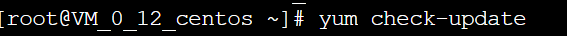

2.接下来添加Docker的官方仓库，下载最新的Docker并安装：

curl -fsSL https://get.docker.com/ | sh

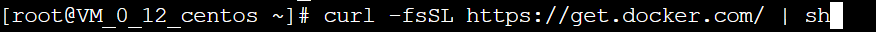

3.安装完成之后启动Docker守护进程，即Docker服务：

sudo systemctl start docker

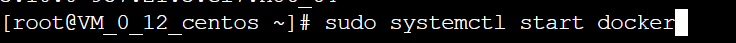

4.验证Docker是否成功启动：

sudo systemctl status docker

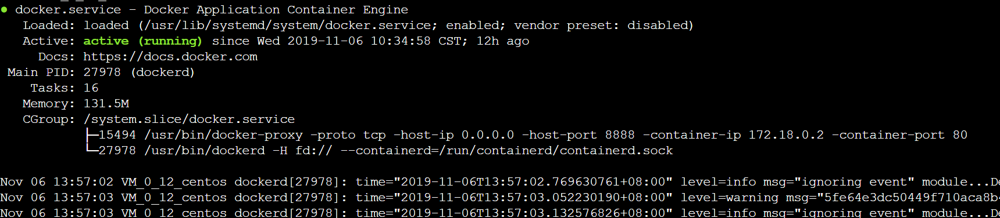

5.最后，确保Docker当服务器启动时自启动：

systemctl enable docker

6.还可以查看一下Docker的版本信息：

docker version

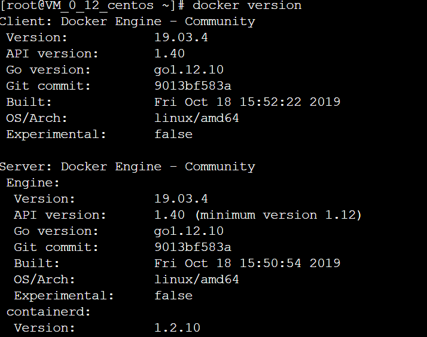

# 2.Docker的基本概念

Docker包含了三个基本的概念将在本文中出现：镜像、容器、仓库。

- 镜像（Images）
- 容器（Containers）
- 仓库（Repositories）

## 镜像

只读的模板，包含可以创建容器的指令，类比于面向对象中的类。镜像采用分层设计的方式。

上层的镜像依赖于下层的镜像，并且包含相关的配置。

**容器**
容器是镜像的一个运行实例，类比于面向对象中类的实例对象，如上图中最上层。你可以创建、运行、停止、移动和删除容器。容器的读写并不会写到镜像之中，并且Docker可以很好的隔离多个运行的容器。使用docker ps -a命令可以列出本地所有的容器，包括非活跃的容器。

**仓库**
仓库是镜像集中存放的地方。你可以把镜像存放与本地，但若想要共享镜像，需要一种镜像分发服务，比如Docker Registry。比较有名的公共Registry服务如Docker官方的Docker Hub，本文后续将使用到。

**Docker基本操作**
**Docker的命令使用**

Docker命令的基本格式：

> docker [选项] [命令] [参数]

查看docker所有的命令，键入：

> docker

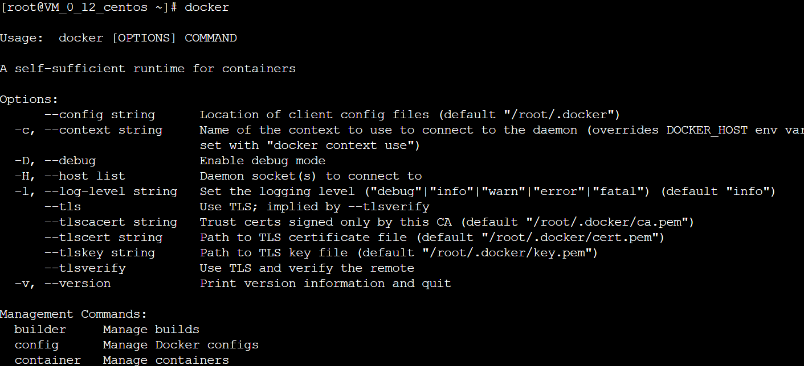

特定命令的使用帮助：

> docker 特定命令 --help

查看当前系统docker的相关信息：

> docker info

输出为（图片不完全覆盖所有信息）：

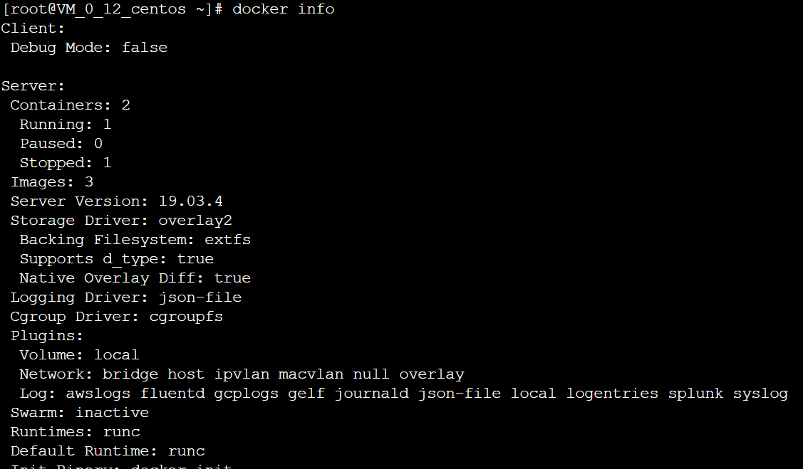

加载Docker镜像
Docker镜像是容器运行的基础，默认情况下，将从Docker Hub拉取镜像。首先使用search命令查询Docker Hub中的可用镜像，这里以查询可用的CentOS镜像为例：

docker search centos

命令从Docker Hub拉取centos镜像的相关信息，并返回可用镜像的列表，输出结果类似于：

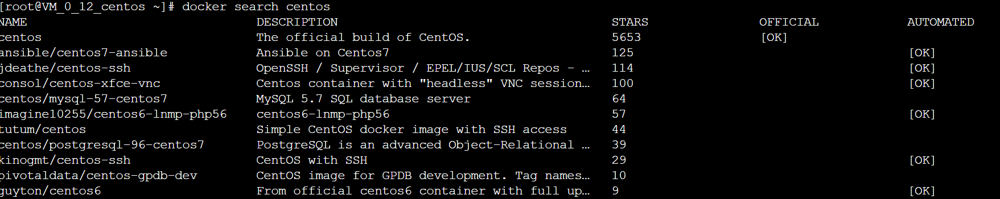

接下来拉取官方版本(OFFICIAL)的镜像：

> docker pull centos

一旦镜像下载完成，可以基于该镜像运行容器，使用run命令：

> docker run centos

查看一下当前系统中存在的镜像：

> docker images

前面的没截图

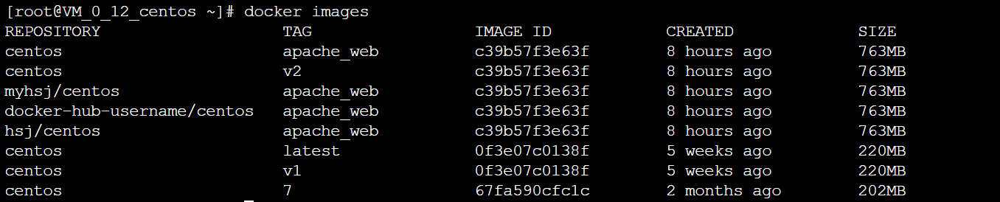

## 运行Docker容器

以上述的CentOS镜像为例运行其容器，使用-it参数进入交互shell模式：

为了避免安装好的word press被覆盖，我使用了新的端口

```
docker run -d -it --privileged --name wordpress -p 8888:80 -d centos:7 /usr/sbin/init
```


**进入容器前台（容器id可以只写前几位，如 ：92）**

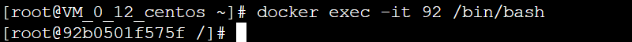

### 容器中安装wordpress

参考我的git hub里面的second文件

### 推送带有wordpress的镜像

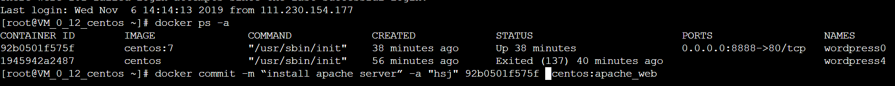

这种提交类似于git协议的提交，同样这里提交的镜像只保存在本地。后续可以提交到远程镜像仓库，比如Docker Hub。
再次使用镜像查看命令：

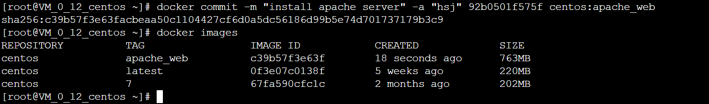

docker tag  c39b57f3e63f    centos:v2

docker tag  c39b57f3e63f  myhsj/centos:apache_web

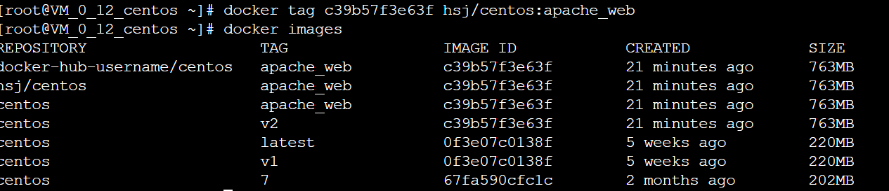

推送镜像到远程镜像仓库
可以把本地镜像推送到远程镜像仓库，最为著名的就是Docker官方的Docker Hub。当然比如阿里也提供容器仓库，同时也可以自己构建镜像仓库。这里以Docker Hub为例介绍如何实现镜像推送。首先要到Docker Hub上进行注册，然后这里我们使用shell登录：

docker login -u myhsj

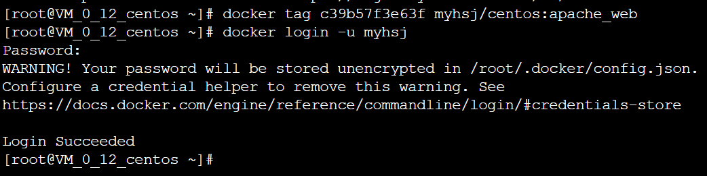

输入密码。用户名和密码都正确，随后会显示登录成功。
使用如下命令推送新创建的镜像：

docker push myhsj/centos:apache_web

这将花费一定的时间，完成之后登陆Docker Hub，查看Repository，可以看到新上传的镜像。


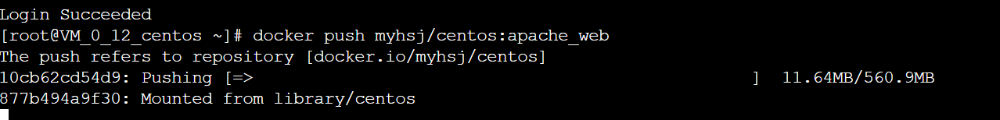查看

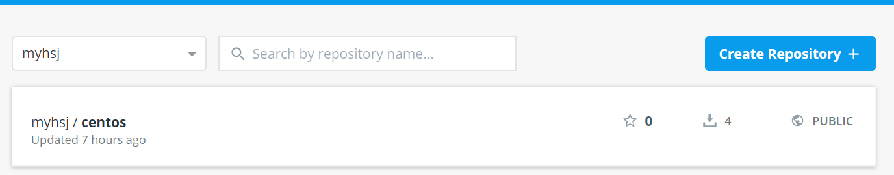

