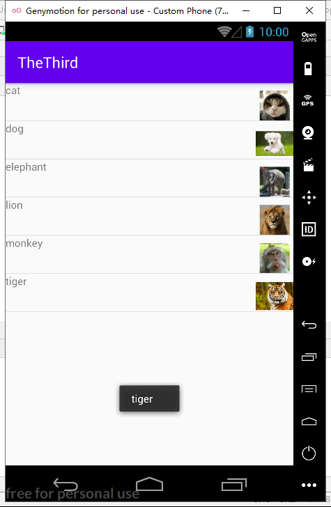
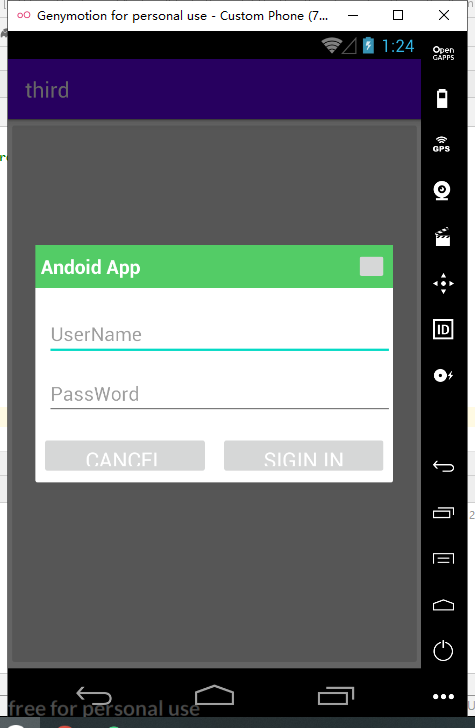
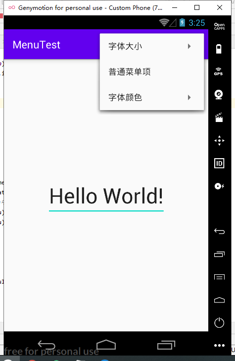

###                                           **Android开发实验三

**第一题**

​       运行的主界面的代码：

```xml
<?xml version="1.0" encoding="utf-8"?>
<RelativeLayout 
                xmlns:android="http://schemas.android.com/apk/res/android"   
                xmlns:app="http://schemas.android.com/apk/res-auto"   
                xmlns:tools="http://schemas.android.com/tools"   
                android:layout_width="match_parent"   
                android:layout_height="match_parent"    
                tools:context=".MainActivity"> 
    <ListView      
              android:id="@+id/listview"     
              android:layout_width="match_parent"   
              android:layout_height="match_parent">
    </ListView>
</RelativeLayout>
```

cell的模板代码：

```xml
<?xml version="1.0" encoding="utf-8"?>
<LinearLayout xmlns:android="http://schemas.android.com/apk/res/android"  
              android:layout_width="match_parent"    
              android:layout_height="match_parent"    
              android:orientation="vertical">   
    <RelativeLayout        
                    android:layout_height="wrap_content">      
        <TextView           
                  android:id="@+id/text1"      
                  android:layout_width="match_parent"  
                  android:layout_height="match_parent"/>    
        <ImageView         
                   android:id="@+id/image1"      
                   android:layout_alignParentRight="true"       
                   android:layout_width="50dp"          
                   android:layout_height="50dp"          
                   android:paddingTop="10dp"/>    
    </RelativeLayout>
</LinearLayout>
```

Java代码：

```java
package com.example.thethird;
import androidx.appcompat.app.AppCompatActivity;
import android.content.Intent;
import android.os.Bundle;
import android.view.View;
import android.widget.AdapterView;
import android.widget.Button;
import android.widget.GridView;
import android.widget.ListView;
import android.widget.SimpleAdapter;
import android.widget.Toast;
import java.util.ArrayList;
import java.util.HashMap;
import java.util.List;
import java.util.Map;
public class MainActivity extends AppCompatActivity {    
    private int[] picture = new int[]
    {
        R.drawable.cat, R.drawable.dog,  R.drawable.elephant,           
     R.drawable.lion, R.drawable.monkey, R.drawable.tiger
    };
    private String[] name = new String[]
    {
        "cat", "dog", "elephant", "lion", "monkey", "tiger"
    };    
    List<Map<String, Object>> list;   
    @Override    
    protected void onCreate(Bundle savedInstanceState) { 
        super.onCreate(savedInstanceState);  
        setContentView(R.layout.activity_main); 
        ListView listView = findViewById(R.id.listview);  
        list = new ArrayList<Map<String, Object>>();
        for (int i = 0; i < picture.length; i++) {
            Map<String, Object> map = new HashMap<String, Object>();  
            map.put("image", picture[i]);          
            map.put("name", name[i]);      
            list.add(map);       
        }     
        SimpleAdapter simpleAdapter = new SimpleAdapter(this, list, R.layout.cell,   
                    new String[]{"image", "name"}, new int[]{R.id.image1, R.id.text1});   
        listView.setAdapter(simpleAdapter);   
        listView.setOnItemClickListener(new AdapterView.OnItemClickListener() {       
            @Override         
            public void onItemClick(AdapterView<?> parent, View view, int position, long id) {
                Map<String, Object> map = list.get(position);    
                System.out.println("asdfasdfa");   
                Toast.makeText(MainActivity.this, (String)map.get("name"), Toast.LENGTH_SHORT).show();  
            }       
        });   
    }
}
```

运行的结果：



第一题的总结：

要把所有的数据放入到一个list里面，才可以保证是同一个cell的。

**第二题：**

主文件代码：

```xml
<?xml version="1.0" encoding="utf-8"?>
<RelativeLayout
                xmlns:android="http://schemas.android.com/apk/res/android"  
                xmlns:app="http://schemas.android.com/apk/res-auto"   
                xmlns:tools="http://schemas.android.com/tools"  
                android:id="@+id/cell"    
                android:layout_width="match_parent"   
                android:layout_height="match_parent"    
                android:orientation="vertical"   
                tools:context=".MainActivity"> 
    <Button       
            android:id="@+id/button1"    
            android:layout_width="match_parent"     
            android:layout_height="match_parent"   
            android:gravity="center"    
            android:text="点击此按钮" />
</RelativeLayout>
```

cell文件代码：

```xml
<?xml version="1.0" encoding="utf-8"?>
<RelativeLayout 
                xmlns:android="http://schemas.android.com/apk/res/android"  
                android:id="@+id/RelativeLayout1"   
                android:layout_width="match_parent"   
                android:layout_height="match_parent"  
                android:orientation="vertical">   
    <RelativeLayout       
                    android:id="@+id/titlelayout" 
                    android:layout_width="match_parent"  
                    android:layout_height="wrap_content"
                    android:layout_alignParentLeft="true"    
                    android:layout_alignParentTop="true"    
                    android:background="#53CC66"        
                    android:padding="5dp">  
        <TextView          
                  android:layout_width="match_parent"      
                  android:layout_height="wrap_content"    
                  android:layout_centerVertical="true"  
                  android:text="Andoid App"          
                  android:textColor="#ffffff"        
                  android:textSize="18sp"        
                  android:textStyle="bold" />      
        <Button           
                android:id="@+id/btn_cancle"    
                android:layout_width="30dp"   
                android:layout_height="30dp" 
                android:layout_alignParentRight="true" />   
    </RelativeLayout>   
    <LinearLayout       
                  android:id="@+id/ly_detail"  
                  android:layout_width="match_parent"    
                  android:layout_height="wrap_content"   
                  android:layout_below="@+id/titlelayout"     
                  android:layout_alignParentLeft="true"  
                  android:layout_centerInParent="true"    
                  android:orientation="vertical">      
        <EditText          
                  android:layout_width="match_parent"  
                  android:layout_height="wrap_content"   
                  android:layout_marginLeft="10dp"   
                  android:layout_marginTop="20dp"     
                  android:hint="UserName"     
                  android:textColor="#04AEDA"      
                  android:textSize="18sp" />  
        <EditText          
                  android:layout_width="match_parent"  
                  android:layout_height="wrap_content"  
                  android:layout_marginLeft="10dp"    
                  android:layout_marginTop="10dp"        
                  android:hint="PassWord"          
                  android:textColor="#04AEDA"    
                  android:textSize="18sp" />  
    </LinearLayout>  
    <LinearLayout      
                  android:layout_width="match_parent"    
                  android:layout_height="wrap_content"   
                  android:layout_below="@+id/ly_detail" 
                  android:layout_marginTop="10dp"    
                  android:orientation="horizontal"> 
        <Button        
                android:id="@+id/btn_blog"       
                android:layout_width="match_parent"  
                android:layout_height="40dp"         
                android:layout_margin="5dp"         
                android:layout_weight="1"          
                android:text="Cancel"        
                android:textColor="#ffffff"  
                android:textSize="20sp" />   
        <Button         
                android:id="@+id/btn_close"     
                android:layout_width="match_parent" 
                android:layout_height="40dp"          
                android:layout_margin="5dp"        
                android:layout_weight="1"         
                android:text="Sigin In"     
                android:textColor="#ffffff"   
                android:textSize="20sp" /> 
    </LinearLayout>
</RelativeLayout>
```

Java代码：

```java
package com.example.third;
import androidx.appcompat.app.AlertDialog;
import androidx.appcompat.app.AppCompatActivity;
import android.content.Context;
import android.os.Bundle;
import android.view.LayoutInflater;
import android.view.View;
import android.widget.Button;
public class MainActivity extends AppCompatActivity { 
    private Button btn_show;   
    private View view_custom;    
    private Context mContext;  
    private AlertDialog alert = null; 
    private AlertDialog.Builder builder = null; 
    @Override   
    protected void onCreate(Bundle savedInstanceState) { 
        super.onCreate(savedInstanceState);     
        setContentView(R.layout.activity_main);   
        mContext = MainActivity.this;      
        btn_show = findViewById(R.id.button1); 
        //初始化Builder       
        builder = new AlertDialog.Builder(mContext);  
        //加载自定义的那个View,同时设置下     
        final LayoutInflater inflater = MainActivity.this.getLayoutInflater(); 
        view_custom = inflater.inflate(R.layout.cell, null,false);  
        builder.setView(view_custom);      
        builder.setCancelable(false);    
        alert = builder.create();    
        btn_show.setOnClickListener(new View.OnClickListener() {  
            @Override          
            public void onClick(View v) {      
                alert.show();          
            }       
        }); 
    }
}
```

运行的结果：



**第三题：**

主文件代码：

```xml
<?xml version="1.0" encoding="utf-8"?>
<androidx.constraintlayout.widget.ConstraintLayout  xmlns:android="http://schemas.android.com/apk/res/android"    xmlns:app="http://schemas.android.com/apk/res-auto"    xmlns:tools="http://schemas.android.com/tools"    
 android:layout_width="match_parent"   
 android:layout_height="match_parent"    
 tools:context=".MainActivity">    
    <EditText      
              android:id="@+id/txt"     
              android:layout_width="wrap_content"  
              android:layout_height="wrap_content" 
              android:text="Hello World!"       
              app:layout_constraintBottom_toBottomOf="parent"    
              app:layout_constraintLeft_toLeftOf="parent"   
              app:layout_constraintRight_toRightOf="parent"  
              app:layout_constraintTop_toTopOf="parent" /></androidx.constraintlayout.widget.ConstraintLayout>
```

menu文件：

```xml
<?xml version="1.0" encoding="utf-8"?>
<menu xmlns:android="http://schemas.android.com/apk/res/android">  
    <item        android:title="字体大小">     
        <menu>          
            <!--定义一组选项菜单-->     
            <group android:checkableBehavior="single">    
                <!--定义多个菜单项-->         
                <item            
                      android:id="@+id/font_10"    
                      android:title="10号字体" />  
                <item                 
                      android:id="@+id/font_12"   
                      android:title="16号字体" /> 
                <item                
                      android:id="@+id/font_20"    
                      android:title="20号字体" /> 
            </group>       
        </menu> 
    </item> 
    <!--定义一个普通菜单项--> 
    <item       
          android:id="@+id/plain_item" 
          android:title="普通菜单项" /> 
    <item       
          android:title="字体颜色">   
        <menu>         
            <!--定义一个普通选项菜单-->     
            <group>            
                <!--定义三个菜单项-->   
                <item          
                      android:id="@+id/red_font" 
                      android:title="Red" />    
                <item              
                      android:id="@+id/green_font"    
                      android:title="Black" />    
                <item               
                      android:id="@+id/blue_font"         
                      android:title="Blue" />  
            </group>  
        </menu>  
    </item>
</menu>
```

java文件：

```java
package com.example.menutest;
import androidx.appcompat.app.AppCompatActivity;
import android.annotation.SuppressLint;
import android.graphics.Color;
import android.os.Bundle;
import android.view.Menu;
import android.view.MenuInflater;
import android.view.MenuItem;
import android.widget.TextView;
import android.widget.Toast;
public class MainActivity extends AppCompatActivity { 
    private TextView textView;
    @Override  
    protected void onCreate(Bundle savedInstanceState) {
        super.onCreate(savedInstanceState);  
        setContentView(R.layout.activity_main);  
        textView = (TextView) findViewById(R.id.txt);
    } 
    @SuppressLint("ResourceType") 
    @Override   
    public boolean onCreateOptionsMenu(Menu menu) {  
        MenuInflater inflater = new MenuInflater(this);   
        //装填R.Menu.my_menu菜单，并添加到menu中    
        inflater.inflate(R.xml.menu_main,menu);
        return super.onCreateOptionsMenu(menu);
    }
    //菜单项被单击后的回调方法 
    @Override
    public boolean onOptionsItemSelected(MenuItem item) {
        if (item.isCheckable()){ 
            //勾选菜单项     
            item.setCheckable(true);  
        }   
        //switch 判断单击哪个菜单项，并有针对性的做出响应 
        switch (item.getItemId()){ 
            case R.id.plain_item: 
                Toast.makeText(this, "你单击了普通菜单", Toast.LENGTH_LONG).show();  
                break;    
            case R.id.font_10:
                textView.setTextSize(10 * 2);   
                break;          
            case R.id.font_12: 
                textView.setTextSize(16 * 2); 
                break;            
            case R.id.font_20: 
                textView.setTextSize(20 * 2); 
                break;            
            case R.id.red_font: 
                textView.setTextColor(Color.RED); 
                break;       
            case R.id.green_font:  
                textView.setTextColor(Color.BLACK);  
                break;         
            case R.id.blue_font: 
                textView.setTextColor(Color.BLUE);    
                break;     
        }      
        return true;  
    }
}
```

运行结果：



老师，那个，切换的就不截图了。。。

