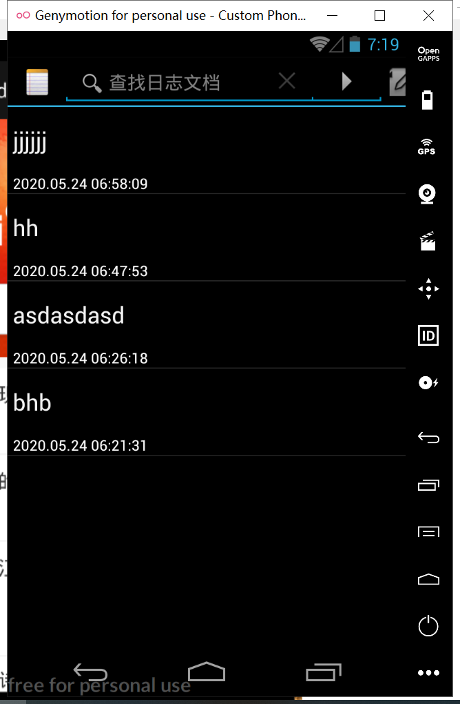
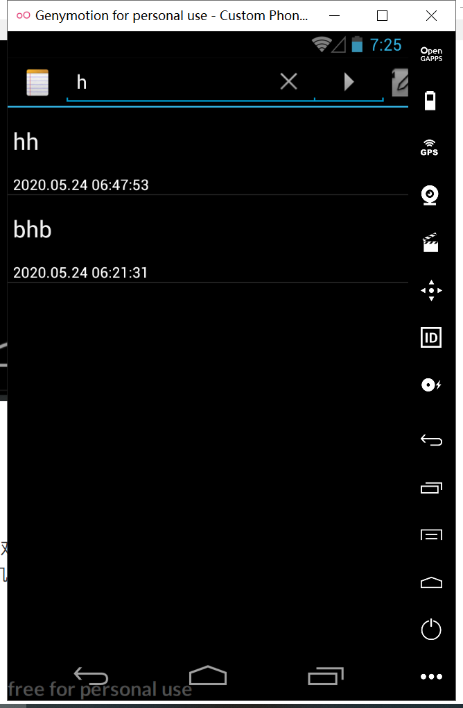

###                                           **Android开发期中考

1.实现时间戳

2.实现查询的功能

**应用一：实现时间戳**

​      修改的代码：在notes_List里面添加显示时间的textview

```xml
<?xml version="1.0" encoding="utf-8"?>
<LinearLayout xmlns:android="http://schemas.android.com/apk/res/android"
    android:id="@+id/layout"
    android:layout_width="match_parent"
    android:layout_height="match_parent"
    android:orientation="vertical">

    <TextView xmlns:android="http://schemas.android.com/apk/res/android"
        android:id="@android:id/text1"
        android:layout_width="match_parent"
        android:layout_height="?android:attr/listPreferredItemHeight"
        android:gravity="center_vertical"
        android:paddingLeft="5dip"
        android:singleLine="true"
        android:textAppearance="?android:attr/textAppearanceLarge" />

    <!--添加显示时间的TextView-->
    <TextView
        android:id="@+id/text1_time"
        android:layout_width="match_parent"
        android:layout_height="wrap_content"
        android:paddingLeft="5dip"
        android:textAppearance="?android:attr/textAppearanceSmall"
        android:textColor="#FFFFFF" />
</LinearLayout>

```

  java代码：代码量比较多（只显示修改的代码）

```java
//修改的地方一共有两处
//在修改文件的时候
private final void updateNote(String text, String title) {

        // Sets up a map to contain values to be updated in the provider.
        ContentValues values = new ContentValues();
        //获取系统的当前的时间
        Long now = Long.valueOf(System.currentTimeMillis());
        Date date = new Date(now);
        //格式化数据
        SimpleDateFormat format = new SimpleDateFormat("yyyy.MM.dd HH:mm:ss");
        String dateTime = format.format(date);
        //将格式化的数据放入到values里面
        values.put(NotePad.Notes.COLUMN_NAME_MODIFICATION_DATE, dateTime);
        if (mState == STATE_INSERT) {
            if (title == null) {
                int length = text.length();
                title = text.substring(0, Math.min(30, length));
                if (length > 30) {
                    int lastSpace = title.lastIndexOf(' ');
                    if (lastSpace > 0) {
                        title = title.substring(0, lastSpace);
                    }
                }
            }
            values.put(NotePad.Notes.COLUMN_NAME_TITLE, title);
        } else if (title != null) {
            values.put(NotePad.Notes.COLUMN_NAME_TITLE, title);
        }
        values.put(NotePad.Notes.COLUMN_NAME_NOTE, text);

      
        getContentResolver().update(
                mUri,    // The URI for the record to update.
                values,  // The map of column names and new values to apply to them.
                null,    // No selection criteria are used, so no where columns are 
                null     // No where columns are used, so no where arguments are 
            );


    }


//在插入的时候
    //插入的方法
    @Override
    public Uri insert(Uri uri, ContentValues initialValues) {

        // Validates the incoming URI. Only the full provider URI is allowed for inserts.
        if (sUriMatcher.match(uri) != NOTES) {
            throw new IllegalArgumentException("Unknown URI " + uri);
        }

        // A map to hold the new record's values.
        ContentValues values;

        // If the incoming values map is not null, uses it for the new values.
        if (initialValues != null) {
            values = new ContentValues(initialValues);

        } else {
            // Otherwise, create a new value map
            values = new ContentValues();
        }

        // Gets the current system time in milliseconds
        Long now = Long.valueOf(System.currentTimeMillis());
        Date date = new Date(now);
        SimpleDateFormat format = new SimpleDateFormat("yyyy.MM.dd HH:mm:ss");
        String dateTime = format.format(date);

        // If the values map doesn't contain the creation date, sets the value to the current time.
        if (values.containsKey(NotePad.Notes.COLUMN_NAME_CREATE_DATE) == false) {
            values.put(NotePad.Notes.COLUMN_NAME_CREATE_DATE, dateTime);
        }

        // If the values map doesn't contain the modification date, sets the value to the current
        // time.
        if (values.containsKey(NotePad.Notes.COLUMN_NAME_MODIFICATION_DATE) == false) {
            values.put(NotePad.Notes.COLUMN_NAME_MODIFICATION_DATE, dateTime);
        }

        // If the values map doesn't contain a title, sets the value to the default title.
        if (values.containsKey(NotePad.Notes.COLUMN_NAME_TITLE) == false) {
            Resources r = Resources.getSystem();
            values.put(NotePad.Notes.COLUMN_NAME_TITLE, r.getString(android.R.string.untitled));
        }

        // If the values map doesn't contain note text, sets the value to an empty string.
        if (values.containsKey(NotePad.Notes.COLUMN_NAME_NOTE) == false) {
            values.put(NotePad.Notes.COLUMN_NAME_NOTE, "");
        }

        // Opens the database object in "write" mode.
        SQLiteDatabase db = mOpenHelper.getWritableDatabase();

        // Performs the insert and returns the ID of the new note.
        long rowId = db.insert(
                NotePad.Notes.TABLE_NAME,       
                NotePad.Notes.COLUMN_NAME_NOTE,  
                values                          
        );

        // If the insert succeeded, the row ID exists.
        if (rowId > 0) {
            // Creates a URI with the note ID pattern and the new row ID appended to it.
            Uri noteUri = ContentUris.withAppendedId(NotePad.Notes.CONTENT_ID_URI_BASE, rowId);

            // Notifies observers registered against this provider that the data changed.
            getContext().getContentResolver().notifyChange(noteUri, null);
            return noteUri;
        }
        // If the insert didn't succeed, then the rowID is <= 0. Throws an exception.
        throw new SQLException("Failed to insert row into " + uri);
    }
```

运行的结果：




**应用二：**为记事本添加查找的功能

改动的代码：在menu菜单里面添加actionbar的搜索框，并为其添加事件监听

```xml
<?xml version="1.0" encoding="utf-8"?>
<menu xmlns:android="http://schemas.android.com/apk/res/android"
    xmlns:app="http://schemas.android.com/apk/res-auto"
    xmlns:tools="http://schemas.android.com/tools">
    <!--  在这里添加搜索框  -->
    <item android:id="@+id/search"
        android:title="search"
        android:actionViewClass="android.widget.SearchView"
        android:showAsAction="always"
        />
    <item
        android:id="@+id/menu_add"
        android:alphabeticShortcut='a'
        android:icon="@drawable/ic_menu_compose"
        android:showAsAction="always"
        android:title="@string/menu_add" />
    <!--  If there is currently data in the clipboard, this adds a PASTE menu item to the menu
          so that the user can paste in the data.. -->

    <item
        android:id="@+id/menu_paste"
        android:alphabeticShortcut='p'
        android:icon="@drawable/ic_menu_compose"
        android:title="@string/menu_paste" />
</menu>
```

Java代码：在NotesList的onCreateOptionsMenu里面修改代码：

```java
    @Override
    public boolean onCreateOptionsMenu(Menu menu) {
        // Inflate menu from XML resource
        MenuInflater inflater = getMenuInflater();
        inflater.inflate(R.menu.list_options_menu, menu);
        //SearchManager searchManager = (SearchManager) getSystemService(Context.SEARCH_SERVICE);
        // 获取ActionBar上的SearchView
        // 这里需要用到SearchView的布局文件
        // 用MenuItem的getActionView()方法获取android:actionViewClass所对应的实例
        // 这里是android.widget.SearchView
        SearchView searchView = (SearchView) menu.findItem(R.id.search).getActionView();
        //searchView.setSearchableInfo(searchManager.getSearchableInfo(getComponentName()));
        searchView.setSubmitButtonEnabled(true);// 是否显示确认搜索按钮
        // 设置展开后图标的样式,这里只有两种,一种图标在搜索框外,一种在搜索框内
        searchView.setIconifiedByDefault(true);
        searchView.setIconified(true);// 设置
        //searchView.clearFocus();// 清除焦点
        searchView.setQueryHint("查找日志文档");
        searchView.setOnQueryTextListener(new SearchView.OnQueryTextListener() {
            @Override
            public boolean onQueryTextSubmit(String s) {
                Log.i("判断之前",s);
                Cursor cursor = null;
                String[] dataColumns = {NotePad.Notes.COLUMN_NAME_TITLE,
                        NotePad.Notes.COLUMN_NAME_MODIFICATION_DATE};

                int[] viewIDs = {android.R.id.text1, R.id.text1_time};

                SimpleCursorAdapter adapter = null;
                if (s.length() != 0 || s != null) {
                    Log.i("判断空值", s);
                    cursor = managedQuery(
                            getIntent().getData(),            // Use the default content URI for the provider.
                            PROJECTION,                       // Return the note ID and title for each note.
                            NotePad.Notes.COLUMN_NAME_TITLE + " LIKE '%" + s + "%'",                             // No where clause, return all records.
                            null,                             // No where clause, therefore no where column values.
                            NotePad.Notes.DEFAULT_SORT_ORDER  // Use the default sort order.
                    );
                }
                adapter = new SimpleCursorAdapter(
                        NotesList.this,                             // The Context for the ListView
                        R.layout.noteslist_item,          // Points to the XML for a list item
                        cursor,                           // The cursor to get items from
                        dataColumns,
                        viewIDs
                );
                setListAdapter(adapter);
                return true;
            }

            @Override
            public boolean onQueryTextChange(String s) {
                Log.i("判断之前",s);
                Cursor cursor = null;
                String[] dataColumns = {NotePad.Notes.COLUMN_NAME_TITLE,
                        NotePad.Notes.COLUMN_NAME_MODIFICATION_DATE};

                int[] viewIDs = {android.R.id.text1, R.id.text1_time};

                SimpleCursorAdapter adapter = null;
                if (s.length() != 0 || s != null) {
                    Log.i("判断空值", s);
                    cursor = managedQuery(
                            getIntent().getData(),            // Use the default content URI for the provider.
                            PROJECTION,                       // Return the note ID and title for each note.
                            NotePad.Notes.COLUMN_NAME_TITLE + " LIKE '%" + s + "%'",                             // No where clause, return all records.
                            null,                             // No where clause, therefore no where column values.
                            NotePad.Notes.DEFAULT_SORT_ORDER  // Use the default sort order.
                    );
                }
                adapter = new SimpleCursorAdapter(
                        NotesList.this,                             // The Context for the ListView
                        R.layout.noteslist_item,          // Points to the XML for a list item
                        cursor,                           // The cursor to get items from
                        dataColumns,
                        viewIDs
                );
                setListAdapter(adapter);
                return true;
            }
        });


        // Generate any additional actions that can be performed on the
        // overall list.  In a normal install, there are no additional
        // actions found here, but this allows other applications to extend
        // our menu with their own actions.
        Intent intent = new Intent(null, getIntent().getData());
        intent.addCategory(Intent.CATEGORY_ALTERNATIVE);
        menu.addIntentOptions(Menu.CATEGORY_ALTERNATIVE, 0, 0,
                new ComponentName(this, NotesList.class), null, intent, 0, null);

        return super.onCreateOptionsMenu(menu);
    }
```

运行的结果：

1，全部的日志文件


2，输入以后的日志文件



实验总结：

​    对于期中考来说，这次的两个功能还是比较简单的，感谢老师的手下留情。对于这次的，因为对于数据库的使用，NotePade的代码使用的contentProvider的，所以嘞，理解起来困难了一点，感觉还是使用那个，创建一个类，然后继承于sqliteHelper的简单（是不是我太菜了，体会不到provider的博大精深）。
